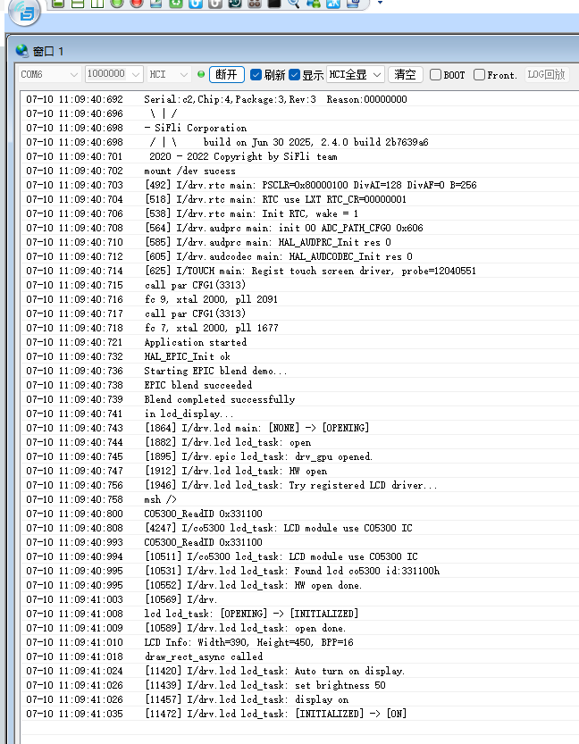
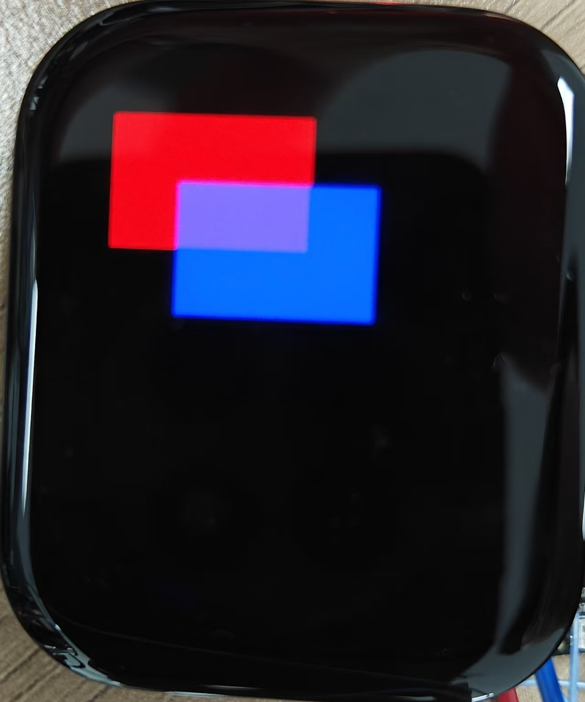

# HAL EPIC Example

EPIC (ePicasso) is our self-developed graphics engine, a hardware acceleration module specifically designed for 2D/2.5D image processing, mainly used to offload CPU load in image operations and improve image processing efficiency.

## Overview

This program is a graphics blending example based on **HAL (Hardware Abstraction Layer)** interface and **EPIC**. It demonstrates how to use the HAL interface to control the EPIC hardware module for layer blending (Alpha Blending), superimposing two rectangular layers with transparency, and finally displaying them on the LCD screen.

---

## Supported Development Boards

- `sf32lb52-lchspi-ulp`
- `sf32lb52-nano_52j`
- `sf32lb52-lcd_n16r8`

---

## Example Function Introduction

### Main process as follows:

1. Initialize EPIC and its underlying EZIP module.
2. Use HAL_EPIC_FillStart() to draw blue and red rectangles in two display memory buffers respectively.
3. Set layer parameters and call HAL_EPIC_BlendStartEx() for layer blending.
4. Output the blended result to the LCD display device.

---

## Example Usage
### Compilation and Flashing
Switch to the example project directory and run the scons command to compile:
```
scons --board=sf32lb52-lchspi-ulp -j8
```
Execute the flashing command:
```
build_sf32lb52-lchspi-ulp_hcpu\uart_download.bat
```
Select the port as prompted for download:
```none
please input the serial port num:6
```

#### Example Output Result Display:
Serial port window prints as shown:

Will display on the LCD screen as shown:


---

## Example Explanation
### Key interfaces used:
| Interface Name                        | Function Description                         |
|-----------------------------|------------------------------|
| HAL_EZIP_Init()	          | Initialize EZIP module         |
| HAL_EPIC_Init()        | Initialize EPIC graphics controller            |
| HAL_EPIC_LayerConfigInit()| Initialize layer configuration structure               |
| HAL_EPIC_LayerSetDataOffset() | Set layer data offset (for cropping)     |
| HAL_EPIC_FillStart()    | Start color fill operation                |
| HAL_EPIC_BlendStartEx()   | Start multi-layer blending operation                   |
---
### Notes
Crop area settings need to be careful
Default cropping behavior:
If HAL_EPIC_LayerSetDataOffset() is not called, it defaults to cropping image data from the first address pointed to by the layer.data pointer, which is (0, 0) in this example.

#### Common issues:
If the fill area is not within the crop area, valid image data cannot be extracted, causing layer blending to fail.
Example: If the fill area is (100~250, 100~200), but the crop area is (0~150, 0~100), then the actual cropped blending data will be empty.
Solution:
* Method 1: Adjust the fill area to be within the crop area.
* Method 2: Call HAL_EPIC_LayerSetDataOffset(layer, x, y) to set the crop offset, note that the x/y passed should be target coordinates + layer.x_offset / layer.y_offset. 