# gui_guider示例（RT-Thread）

## 支持的平台
<!-- 支持哪些板子和芯片平台 -->
- 任意板子（包括`pc`）

## 例程概述 
本示例通过 gui_guider 创建 UI 界面并导出对应的 .c 文件，随后将以 Imagebtn 控件为例，详细说明如何将生成的代码移植并运行在当前 SDK 环境中。（例程使用的是V8版本的，所以使用 gui_guider 导出的代码，请使用V8版本）

## gui_guider软件的使用
gui_guider软件下载地址：[gui_guider下载](https://www.nxp.com.cn/design/design-center/software/development-software/gui-guider:GUI-GUIDER)，选择.exe文件进行下载
* 通过文档中的下载链接进入官网下载，首先需要进行账号注册并登录成功才能进行下载安装
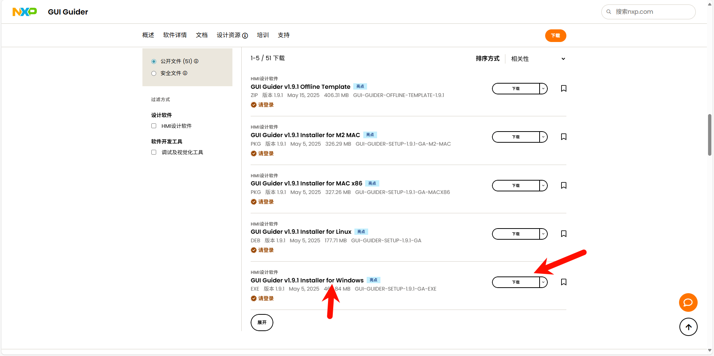


* 下载安装好后打开gui_guider软件，并在首页进行创建工程
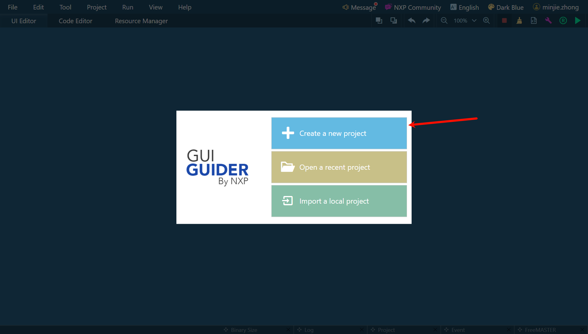

* 点击创建功成之后会有一选择lvgl的版本选择框，选择V8的版本    
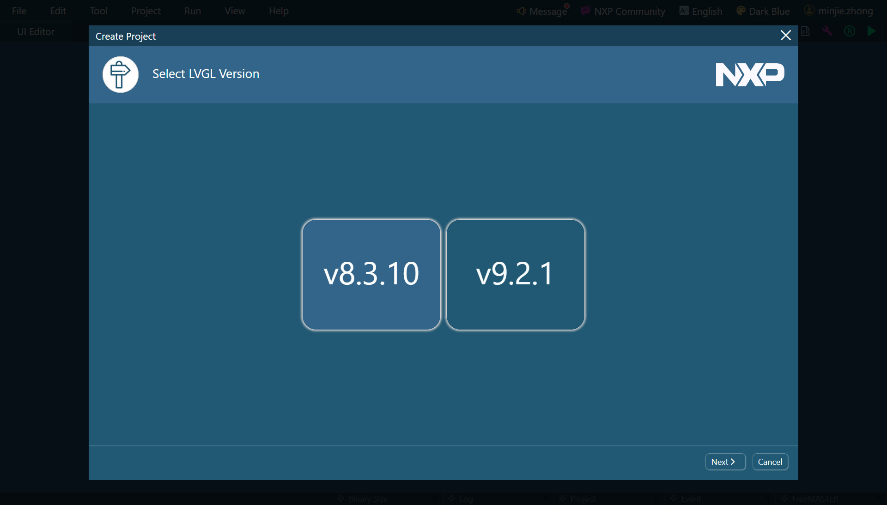

* 创建工程过程中会有项目名称、生成文件导出存放的路径，颜色深度、以及屏幕大小的分辨率
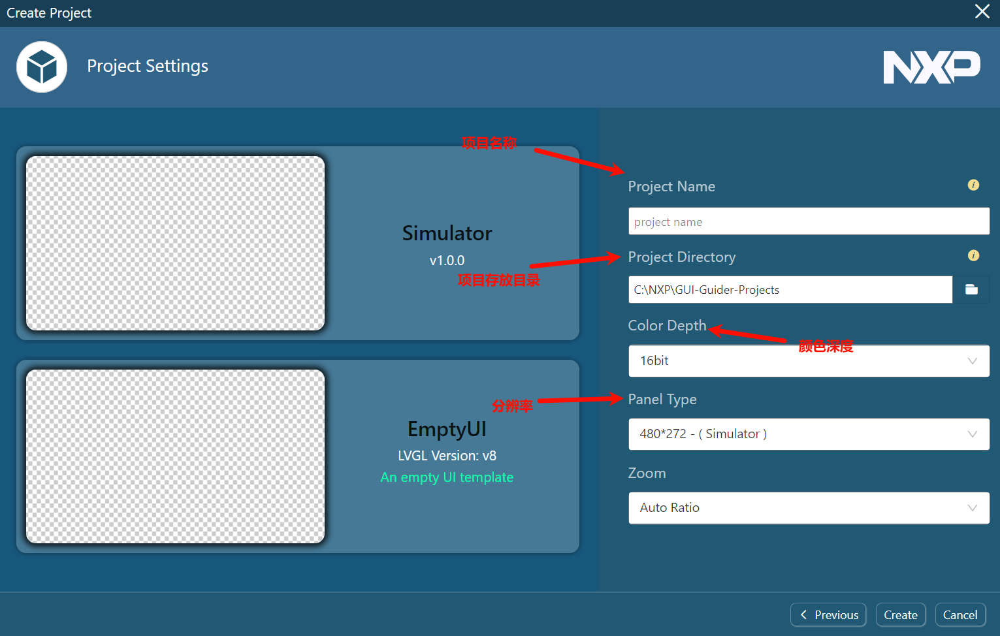

* 随后就可以进行  UI 界面的设计，设计完成之后可以使用模拟器编译和运行看看效果是否符合预期
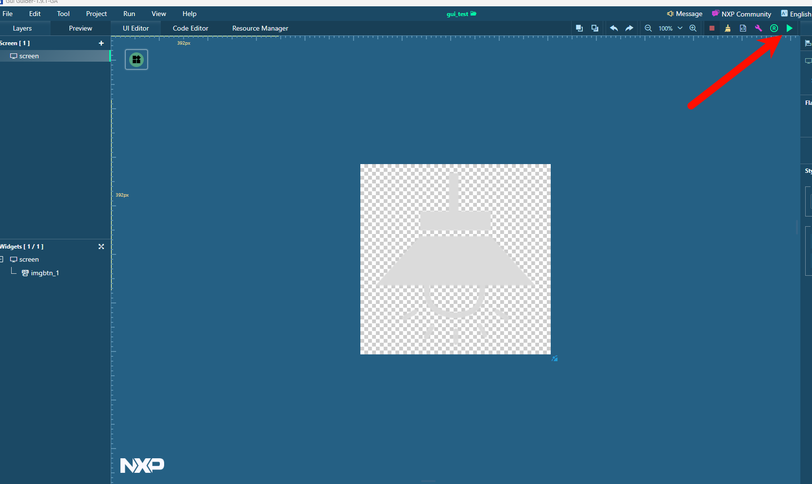

* 符合预期之后可以进行导出生成文件了
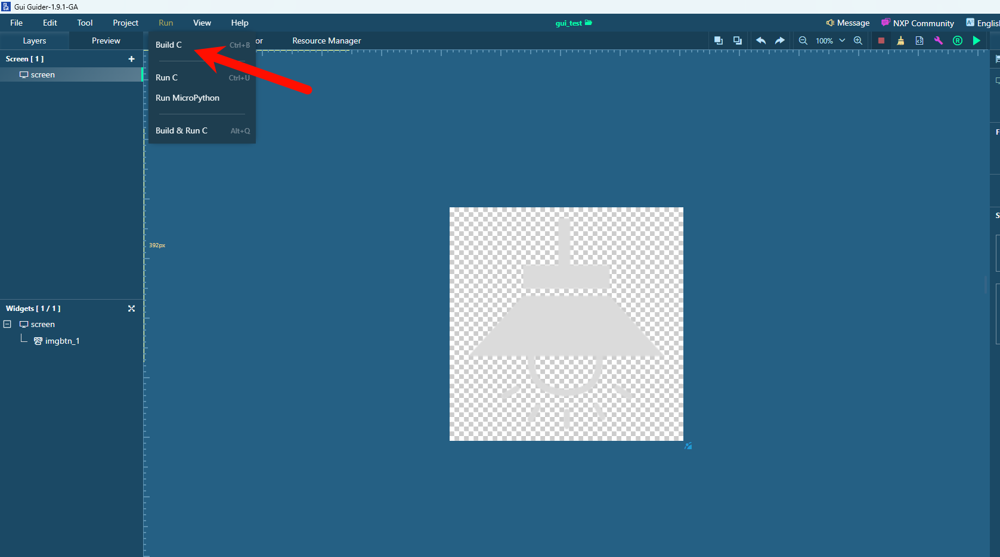

具体其他详细操作可以参考：[gui_guider教程](https://www.bilibili.com/video/BV1RcRqYuENA/)

## gui_guider生成的工程文件
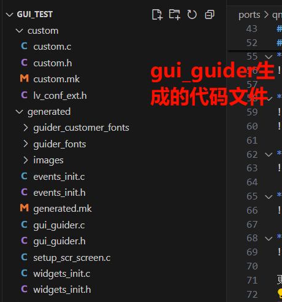
* Custom.c/.h：这两个文件是用户自定义代码的“专属区域”，可以自定义一些界面逻辑（比如给控件加额外功能、自定义算法）

* lv_conf_ext.h：是对 LVGL 核心配置文件 lv_conf.h 的扩展补充，比如：覆盖 LVGL 默认配置（如内存池大小、颜色深度、日志开关）、定义项目特有的宏（方便跨文件复用）

* guider_customer_fonts：这个文件目录用于存放你自己添加的自定义字体文件（比如从外部带入的特殊字体）。GUI Guider 会把这些字体转成 LVGL 能识别的二进制格式，供界面渲染用。

* guider_fonts：这个文件目录存放 GUI Guider 内置字体的生成文件（比如默认的 Roboto、宋体等）。软件会根据你在界面里选的字体，生成对应的 LVGL 字体代码，让控件能正确渲染文字。

* images：这个目录存放 界面里用到的图片资源（如按钮图标、背景图）。GUI Guider 会把原始图片（PNG/JPG 等）转成 LVGL 支持的格式（如二进制数组、C 代码里的常量），减少运行时解码开销。在gui_guider软件里添加、删除、替换图片控件修改图片的压缩方式等导出设置。

* events_init.c/.h：在界面事件逻辑的自动生成的代码，主要包括：按钮点击事件、滑块拖动事件等。在gui_guider软件里对空间做任何交互配置都会使得生成代码改动。

* gui_guider.c/.h：这两个文件是整个界面的饿核心生成代码，包含了：所有控件的创建逻辑(如按钮、标签、滑块等初始化)、界面的层级结构、默认样式、初始属性（比如按钮位置、标签初始文本）。在gui_guider软件中对界面布局、控件属性做任何的修改该文件都会有改动。

* setup_scr_screen.c：是 “屏幕（Screen）” 级别的初始化代码。如果你的项目有多页面（多 Screen），每个 Screen 对应一个这样的文件。初始化这个屏幕下的所有控件。

* widgets_init.c/.h：是控件初始化的统一入口。

## 移植gui_guider生成的工程文件

* 由于SDK中采用了 ezip 软件将生成好的图像资源进行进一步的压缩，达到减少空间占用的目的。我们在移植过程中可以选择是否需要采用ezip压缩，在移植之前需要在 gui_guider 目录下新建一个名为 image 的文件夹，在这个目录下创建名为 ezip和no_ezip 两个文件夹。ezip 这个文件夹适用于存放需要压缩的图片资源,no_ezip存放不需要或者不能压缩的图片资源。脚本会自动根据文件的存放的位置在编译的过程中决定是否需要进行压缩。其中编译链接脚本可以参考: [SConscript](image/SConscript).

*  完成了上面的操作后，在project目录下的SConscript中的 `# Add application source code `下面添加如下内容，否则编译的时候会使用不到ezip的功能

```python
objs.extend(SConscript(cwd+'/../image/SConscript', variant_dir="image", duplicate=0))
```
### 开始移植
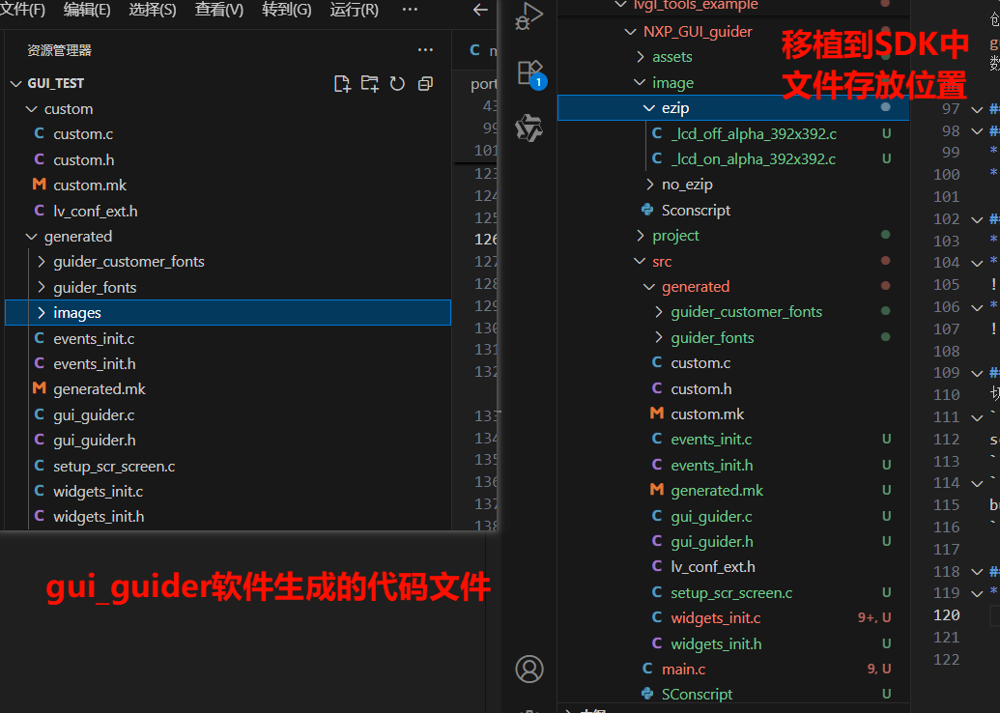
* 第一步：完成了准备工作之后，将生成好并存放在generated/images/.c的文件拷贝到 SDK 中的 image/ezip 文件夹下。在编译的时候可以完成对图像资源文件的进一步压缩。（没有强制性需要使用ezip压缩,也可放在image/no_ezip文件夹下不进行压缩，但是建议使用ezip压缩，可以获得更好的性能）

* 第二步：除了第一步中已经拷贝过的文件，剩余其他的文件都拷贝到src目录下，然后把 custom 目录中的文件放到 generated 目录下，以减少代码改动。但是通过拷贝的话会编译不到generated下一级文件夹中的文件，因此我们还需要更改一下 SConscript 编译链接脚本，在 SConscript 文件中添加如下内容。
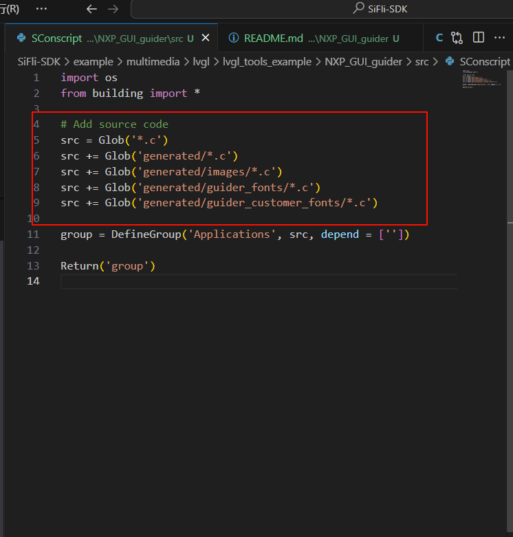
* 第三步：在main.c文件中包含`#include "generated/events_init.h"`,  `#include "generated/gui_guider.h"`这两个头文件，在这个文件中创建一个`lv_ui guider_ui;`，在main函数中调用 `setup_ui(&guider_ui);` `events_init(&guider_ui);` UI 界面的启动接接口函数。
 
## 例程的使用
### 硬件需求
* 一块支持本例程的板子
* 一根USB数据线

### menuconfig配置流程
* 默认已经开好LVGL，不需要进行任何配置
* 在menuconfig中启用LittlevGL2RTT 适配层

* 在menuconfig中选择使用LVGL版本


### 编译和烧录
切换到例程project目录，运行scons命令执行编译：
```
scons --board=sf32lb52-lcd_n16r8 -j32
```
```
build_sf32lb52-lcd_n16r8_hcpu\uart_download.bat
```

### 运行结果
* 屏幕上会先显示 led_of 图片，达到一个关灯的效果
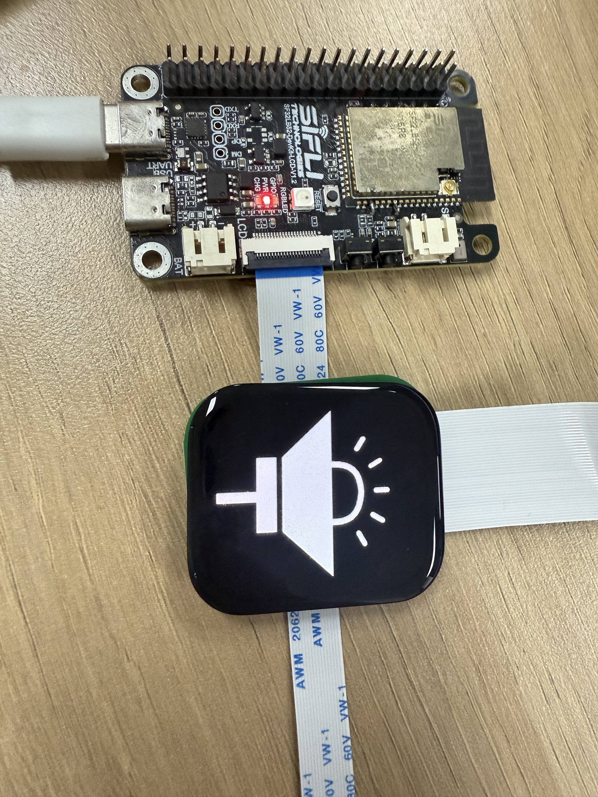

* 点击屏幕，将会图片切换到 led_on 图片，达到一个开灯的效果
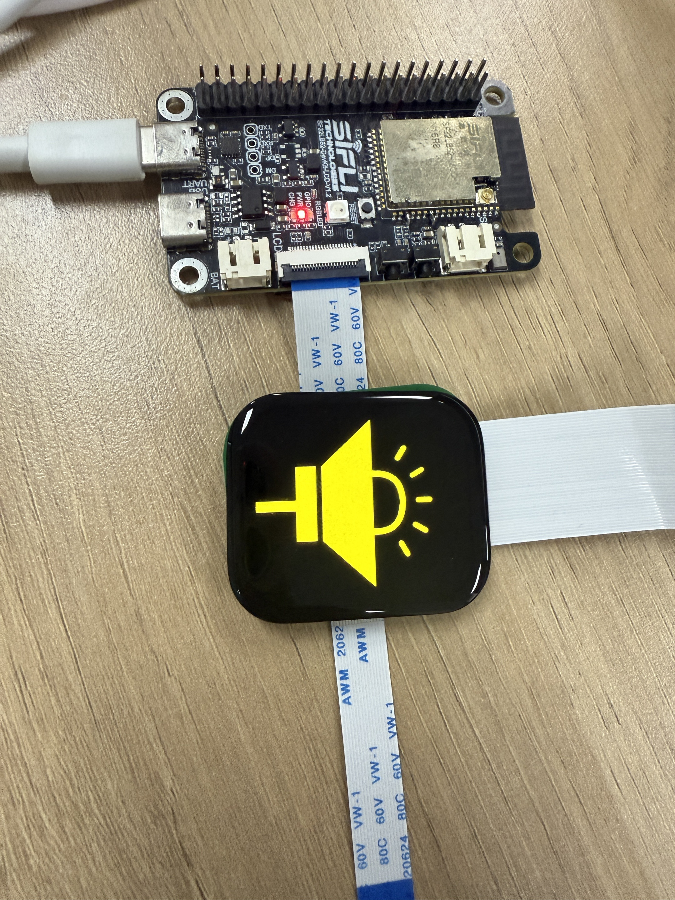

* 再次点击，切回到 led_of 图片，达到一个关灯的效果
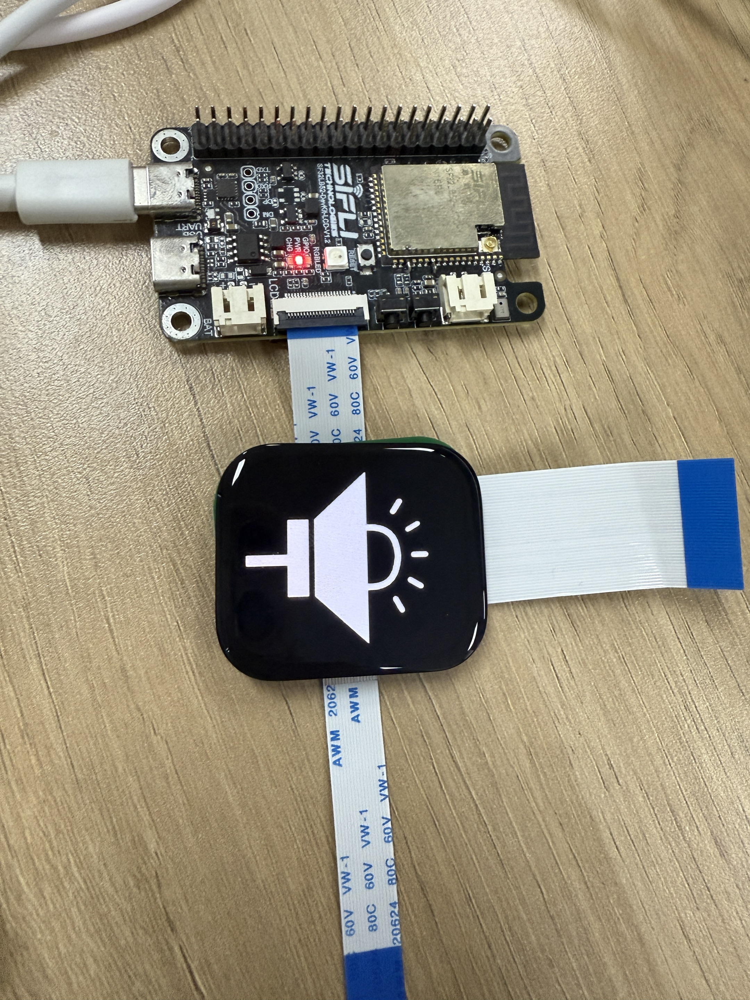