# SquareLine示例（RT-Thread）

## 支持的平台
<!-- 支持哪些板子和芯片平台 -->
- 任意板子（包括`pc`）

## 例程概述 
本示例通过创建两个screen,两个screen中包含了其他的控件，通过button控件实现两个屏幕的互相切换。文档中详细说明如何将生成的代码适配并运行在当前 SDK 环境中。

## Squareline软件的使用
Squareline软件下载地址：[SquareLine下载](https://squareline.io/downloads#lastRelease),进入页面后首先需要进行注册账号才能进行下载安装。

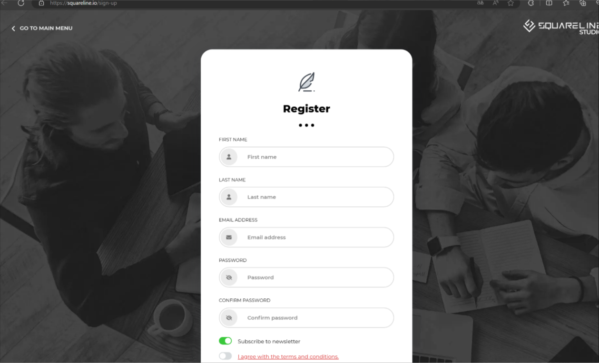
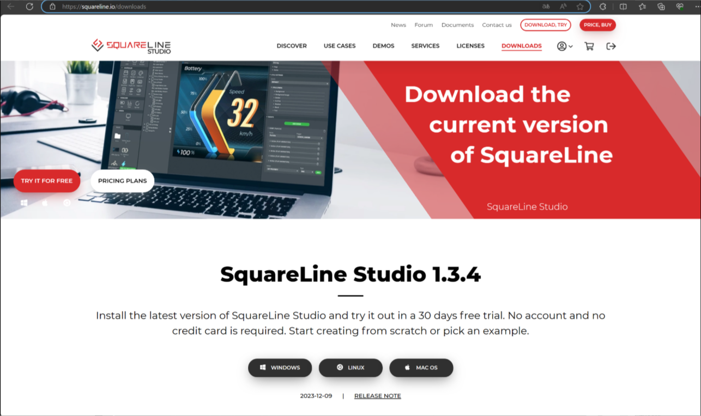

* 下载安装好后打开SquareLine软件,输入注册邮箱密码，点击`LOG_IN`登录,勾选获取的许可证
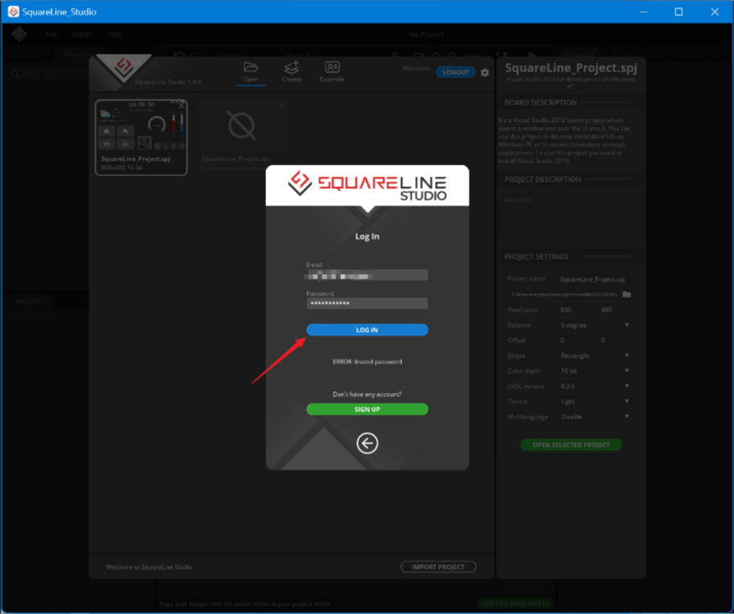

* 登录成功之后选择Create,可以创建多平台的UI工程，配置好工程信息，点击`Create`
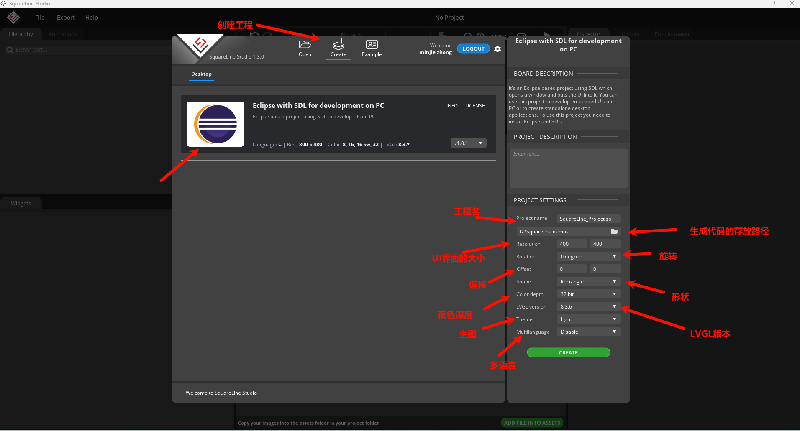

* 下面演示添加控件,其中可以修改布局、事件、设置样式等属性
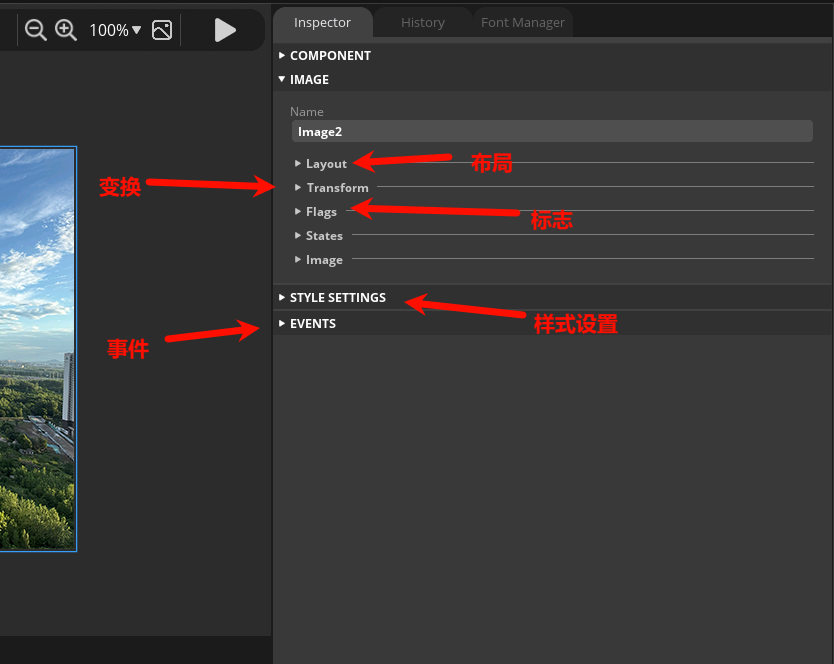

* 完成之后进行编译生成.c文件
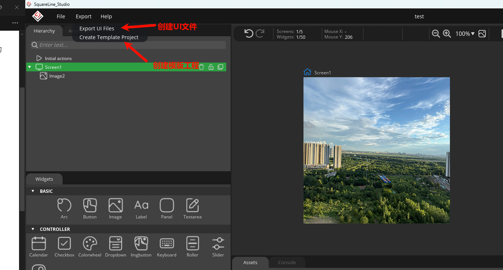

具体其他详细操作可以参考：[squareline教程](https://www.bilibili.com/video/BV1Bu411p7cM)

## squareline生成的工程文件

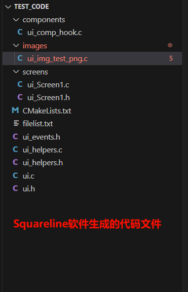

* components：这个目录下存放的嵌入式图形界面开发项目的一部分，包含UI界面的组件定义、初始化和事件处理等代码,如果在软件中使用到了一些事件和组件的话将会在这个目录下创建。

* images：这个目录下存放的生成的图像资源.c文件，用于在LVGL图形界面中显示PNG格式图片

* screens/ui_Screen1.c、ui_Screen1.h：ui_Screen1.c是(UI界面)的具体实现文件，包含了屏幕及其组件的创建和销毁逻辑，ui_Screen1.h是声明了屏幕相关的变量和函数接口，供其他文件引用，如果在Squareline软件中创建了多个屏幕，则会生成多个.c文件，每个文件对应一个屏幕，文件名与屏幕名称一致。

* CMakeLists.txt：这是一个CMake构建配置文件，用于定义和管理整个UI项目的源文件编译规则。

* filelist.txt：管理和编译整个LVGL用户界面项目，定义源文件列表、创建静态库

* ui_events.h：事件处理的头文件，用于声明和管理UI组件的事件回调函数，当添加事件处理后，此文件会包含类似回调函数的声明。目前文件几乎是空的，只包含了基本的头文件保护结构。

* ui_helpers.c/ui_helpers.h：生成的UI项目中常用的辅助函数集合，用于简化UI组件的属性设置、动画控制、屏幕切换等常见操作。它们是Squareline Studio生成代码的核心工具函数库。

* ui.c/ui.h：ui.c文件中实现了UI界面的接口函数，其中包括了 UI 初始化、屏幕销毁。ui.h文件中定义了UI模块的公共接口提供主程序和其他模块调用。

## 移植squareline生成的工程文件
### 移植前的准备工作
* "由于SDK中采用了 ezip 软件将生成好的图像资源进行进一步的压缩，达到减少空间的占用的目的。所以在移植之前我们要在Square_Line目录下新建一个名为 image_ezip 的文件夹，在这个目录下再创建一个名为 ezip 的文件夹。"ezip 这个文件夹用于存放需要压缩的图片资源。最后需要在 image_ezip 文件夹下新建一个 SConscript 文件，用于编译过程中进行ezip硬件加速。如果不需要进行压缩的话，可以将图片移动到image目录下即可，脚本会自动根据文件的存放的位置在编译的过程中决定是否需要进行压缩。其中编译链接脚本可以参考: [SConscript](image/SConscript).
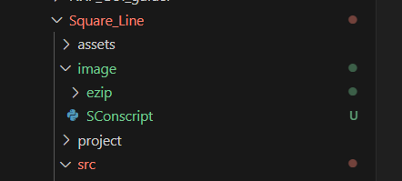

*  完成了上面的操作后，在project目录下的SConscript中的 `# Add application source code `面添加如下内容，否则编译时将无法使用ezip功能。

```python
objs.extend(SConscript(cwd+'/../image_ezip/SConscript', variant_dir="image_ezip", duplicate=0))
```
### 开始移植
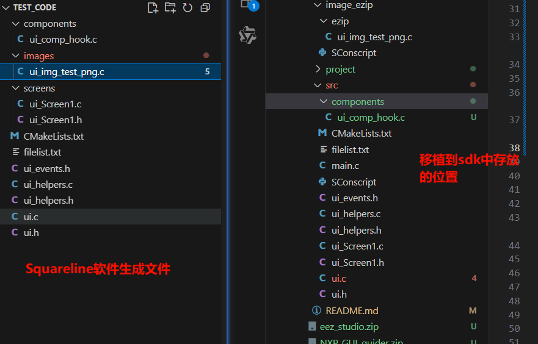
* 第一步：完成了准备工作之后，将生成的images/ui_img_test_png.c文件拷贝到 SDK 中的 image_ezip/ezip 文件夹下。在编译的时候可以完成对图像资源文件的进一步压缩。（没有强制性需要使用ezip压缩,也可放在image/no_ezip文件夹下不进行压缩，但是建议使用ezip压缩，可以获得更好的性能）

* 第二步：除了第一步中已经拷贝过的文件，剩余其他的文件都拷贝到src目录下，但是如果直接拷贝的话会编译不到下一级文件夹中的文件，因此我们还需要更改一下 SConscript 编译链接脚本，在 SConscript 文件中添加如下内容。
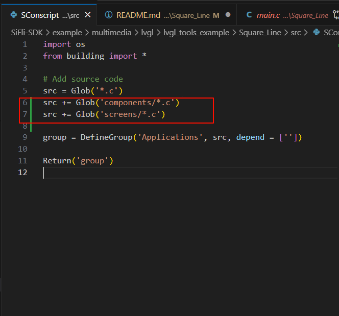

* 第三步：在main.c文件中的main函数中调用 `ui_init();`生成UI界面的启动函数接口。

## 例程的使用
### 硬件需求
* 一块支持本例程的板子
* 一根USB数据线

### menuconfig配置流程
* 默认已经开好LVGL，不需要进行任何配置
* 在menuconfig中启用LittlevGL2RTT 适配层

* 在menuconfig中选择使用LVGL的版本

* 由于生成的代码中采用了默认主题功能，所以需要再menuconfig里面开启LVGL的默认主题功能,
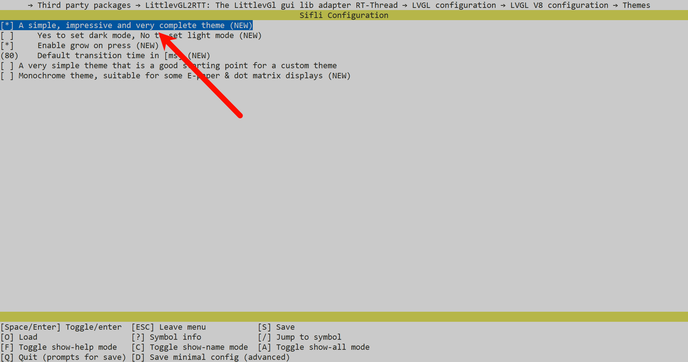
### 编译和烧录
切换到例程project目录，运行scons命令执行编译：
```
scons --board=sf32lb52-lcd_n16r8 -j32
```
```
build_sf32lb52-lcd_n16r8_hcpu\uart_download.bat
```

### 运行结果
* 屏幕上首先会运行screen1，如下图所示。
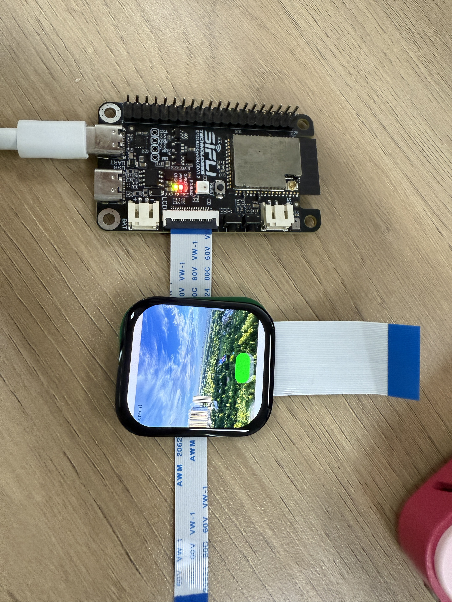
* 通过点击screen1中的button按钮可以实现切换到screen2进行显示，如下图所示。
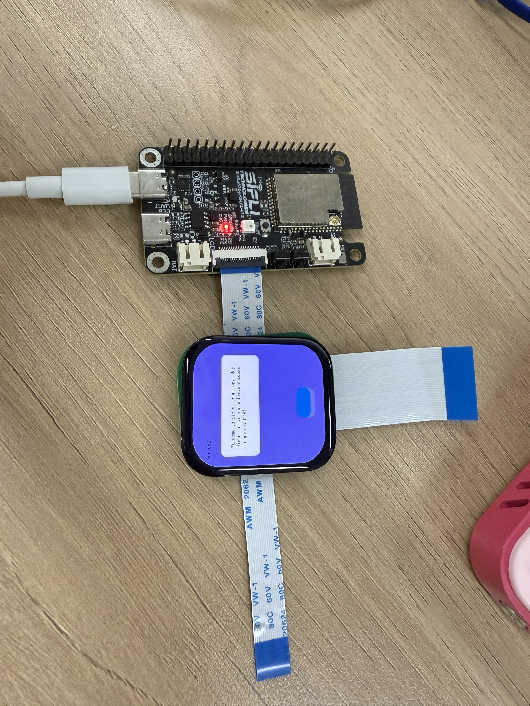
* 点击screen2中button按钮可以返回screen1进行显示。
