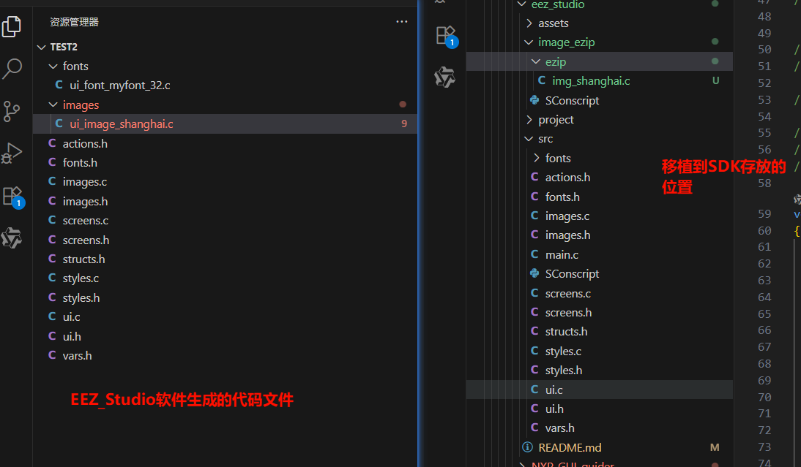
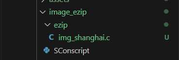
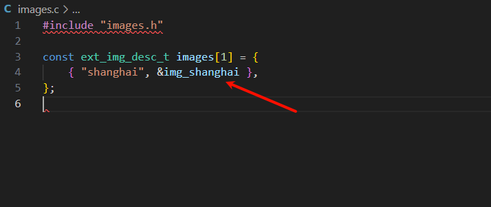
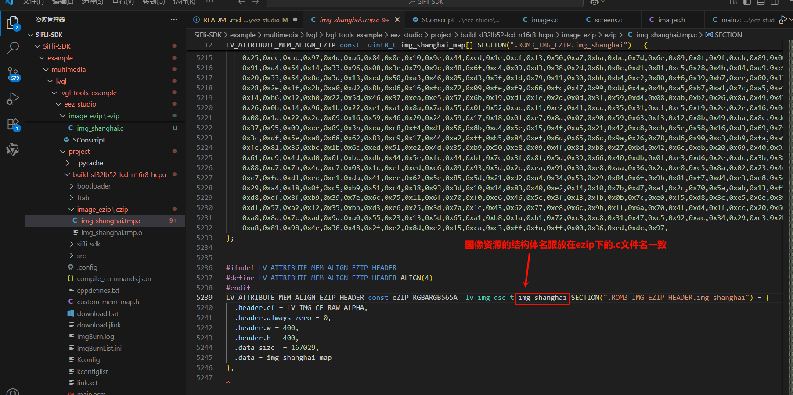
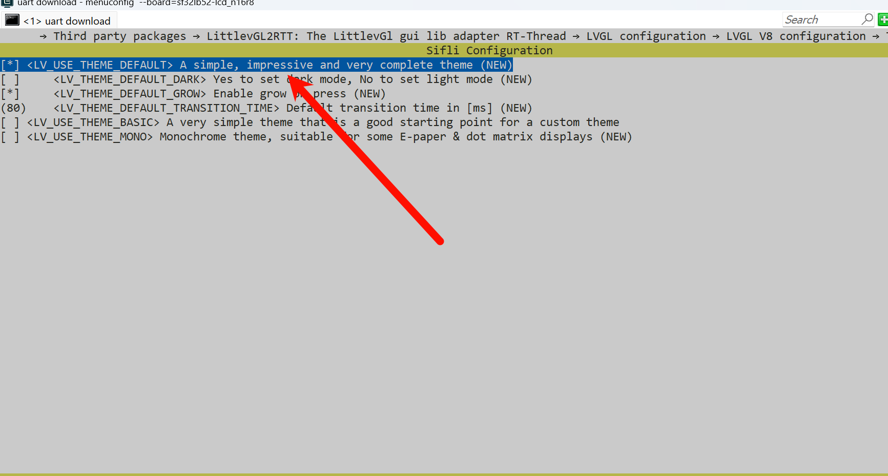

# eez_studio示例（RT-Thread）

## 支持的平台
<!-- 支持哪些板子和芯片平台 -->
- 任意板子（包括`pc`）

## 例程概述 
本示例通过 eez_studio 创建 UI 界面并导出对应的 .c 文件，随后将以 Image 控件为例，详细说明如何将生成的代码移植并运行在当前 SDK 环境中。（例程使用的是V8版本的，所以使用eez_studio导出的代码，请使用V8版本）

## eez_studio软件的使用
eez_studio软件下载地址：[eez_studio下载](https://github.com/eez-open/studio/releases)，选择.exe文件进行下载

* 下载安装好后打开eez_studio软件，并在首页进行创建工程


* 创建工程后，进行添加项目，如图所示操作


* 在界面编辑中，可以设置项目的分辨率、排版布局，以及样式、标志位、小工具、事件和动作等。


* 下面演示添加image控件


* 完成之后进行编译生成.c文件


更多详细操作可参考：[eez_studio 视频教程](https://www.bilibili.com/video/BV1vkp2egERj)

## eez_studio生成的工程文件


* fonts/ui_font_myont_32.c：这是一个自定义字体文件，主要作用包括字体的定义、字符集支持、位图数据存储。自定义的字体会生成在这个文件中。

* image/ui_image_xxx.c：将图像数据转化为C数组的形式，方便后续使用。

* actions.h：生成的 UI 事件处理函数声明的头文件，如
果你的 UI 界面中使用了事件。生成出来的事件处理函数会放在这里。

* fonts.h：这个文件是 UI 项目中声明自定义字体的头文件。在UI 控件中设置字体样式时，会生成对应的头文件。

* images.c/images.h：这个文件是用于管理 UI 界面中图像资源的模块，其中包含了图像资源的声明、定义图像资源的描述结构体。

* screens.c/screens.h：这些文件用于实现 UI 屏幕的创建逻辑、控件布局、事件绑定等功能(其中 UI 界面创建的入口函数也在这个文件中)。

* structs.h：* structs.h：用于 数据结构建 模 的核心模块，虽然当前内容为空，但它是构建 UI 与 Flow 逻辑桥梁的重要组成部分。建议根据项目需求，在此定义结构体以提升代码可维护性和可扩展性。
，虽然当前内容为空，但它是构建 UI 与 Flow 逻辑桥梁的重要组成部分。建议根据项目需求，在此定义结构体以提升代码可维护性和可扩展性。

* styles.c/styles.h：styles.c文件实现了样式的定义(如初始化对象并设置其属性颜色、字体、边框等)，styles.h文件的作用是声明样式资源，提供全局样式接口，给UI 创建是使用。如果在使用EEZ_Studio制作界面布局时使用了样式，那么生成的样式资源相关的代码存放于这些文件中。

* ui.c/ui.h：ui.c文件中实现了 UI 界面的的核心逻辑，其中包括了UI初始化、屏幕加载、定时更新、对象和图像资管理。ui.h文件中定义了UI模块的公共接口和初始化函数，提供主程序和其他模块调用，其中声明了UI初始化函数、定数刷新函数、屏幕加载函数等。

* vars.h：这个文件用于声明和管理UI架构中的全局变量的头文件，为全局状态管理提供接口声明。

## 移植eez_studio生成的工程文件

### 移植前的准备工作
* 由于SDK中采用了 ezip 软件将生成好的图像资源进行进一步的压缩，达到减少空间占用的目的。所以在移植之前我们要在eez_studio目录下新建一个名为 image_ezip 的文件夹，在这个目录下创建一个名为 ezip 的文件夹。ezip 这个文件夹适用于存放需要压缩的图片资源。最后需要在 image_ezip 文件夹下新建一个 SConscript 文件，用于编译链接作用，在 SConscript 文件中添加如下内容：

```python
# for module compiling
import os
from building import *


cwd = GetCurrentDir()

src = []

cwd = GetCurrentDir()  # get current dir path
objs_no_ezip = []
objs_ezip = []
objs_no_ezip += Glob('*.png')
objs_ezip += Glob('ezip/*.c')

if 16 == GetConfigValue('LV_COLOR_DEPTH'):
    img_flags = '-rgb565'
else:
    img_flags = '-rgb888'

src = Env.ImgResource(objs_ezip, img_flags+' -cfile 2 -pal_support')

group = DefineGroup('image_ezip', src, depend = ['PKG_USING_LITTLEVGL2RTT'])  

Return ('group')
```


*  完成了上面的操作后，在project目录下的SConscript中的 `# Add application source code `下面添加如下内容，否则编译的时候会使用不到ezip的功能

```python
objs.extend(SConscript(cwd+'/../image_ezip/SConscript', variant_dir="image_ezip", duplicate=0))
```

* 第一步：完成了准备工作后，将生成好并存放在images/ui_image_shanghai.c的文件拷贝到 SDK 中的image_ezip/ezip文件夹下,并且需要将名字进行修改（由于ezip软件是使用文件名进行压缩的，并且会把压缩好的图像资源变量名更换成.c文件名），将名字修改为images.c中的数组的图像资源名。（这样做的目的是为了减少移植过程中代码的修改）



* 第二步：除去上一步移植过的image文件夹，其他文件夹都拷贝到src目录下。

* 第三步：在main.c中的main函数调用`ui_init();和ui_tick();`生成UI界面的启动接口函数
## 例程的使用
### 硬件需求
* 一块支持本例程的板子
* 一根USB数据线

### menuconfig配置流程
* 默认情况下 LVGL 已经启用，无需额外配置
* 在menuconfig中启用LittlevGL2RTT 适配层

* 在menuconfig中选择使用LVGL版本

* 在menuconfig中选择打开默认主题，用于适用于eez_studio生成的默认主题代码


### 编译和烧录
切换到例程project目录，运行scons命令执行编译：
```
scons --board=sf32lb52-lcd_n16r8 -j32
```
```
build_sf32lb52-lcd_n16r8_hcpu\uart_download.bat
```

### 运行结果
* 屏幕上将显示图片

