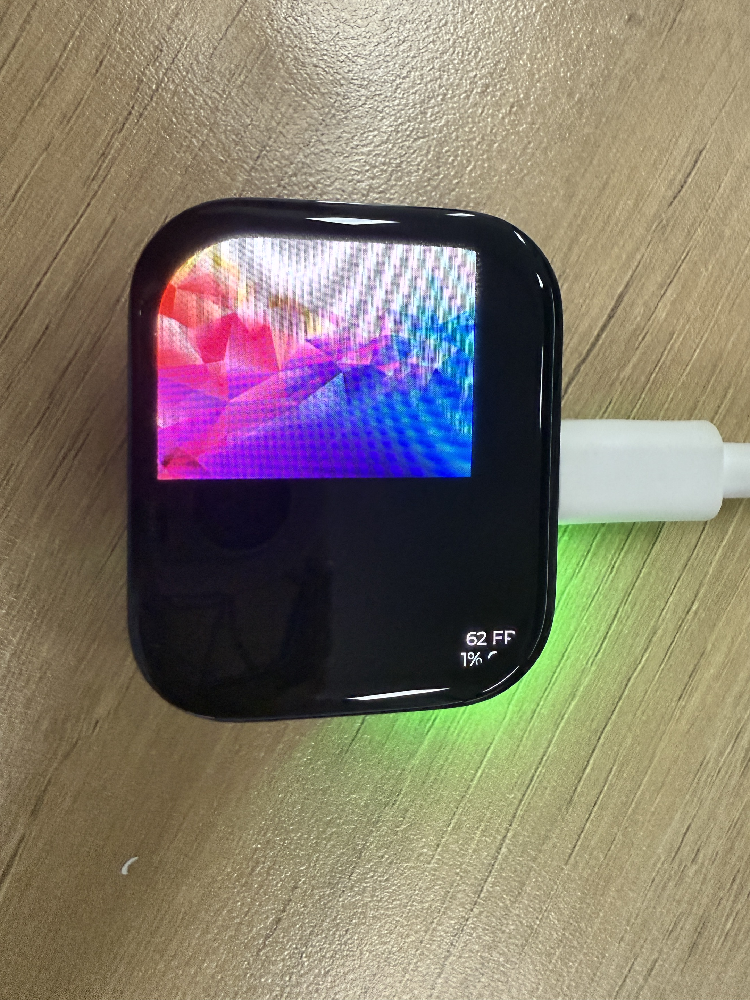
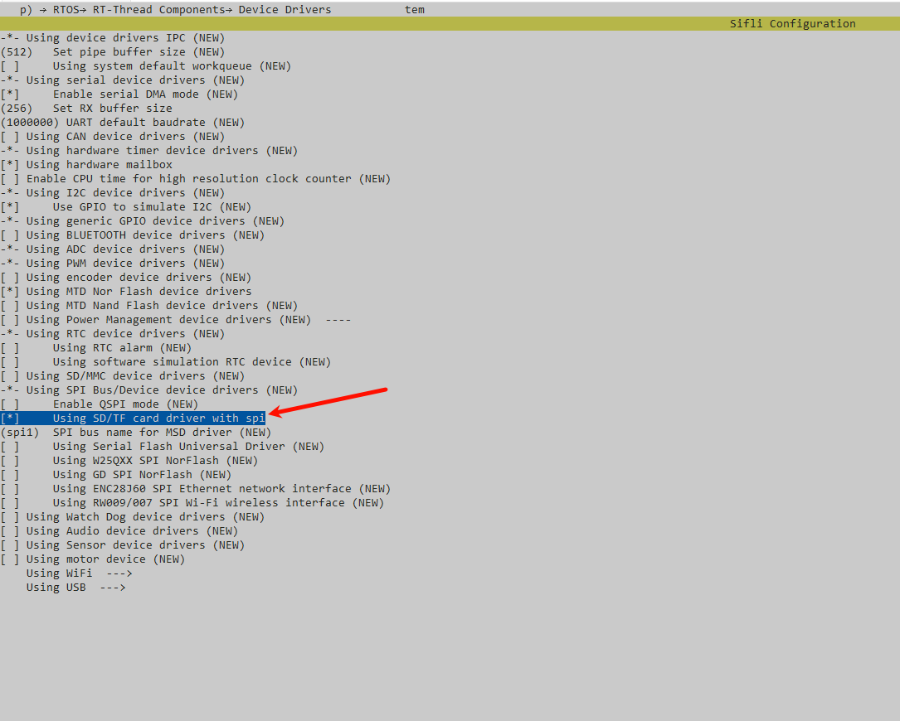
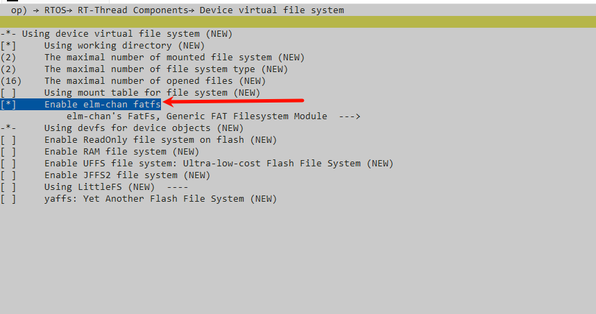
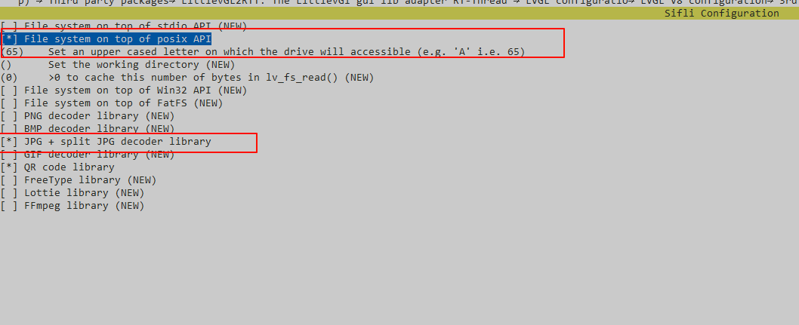
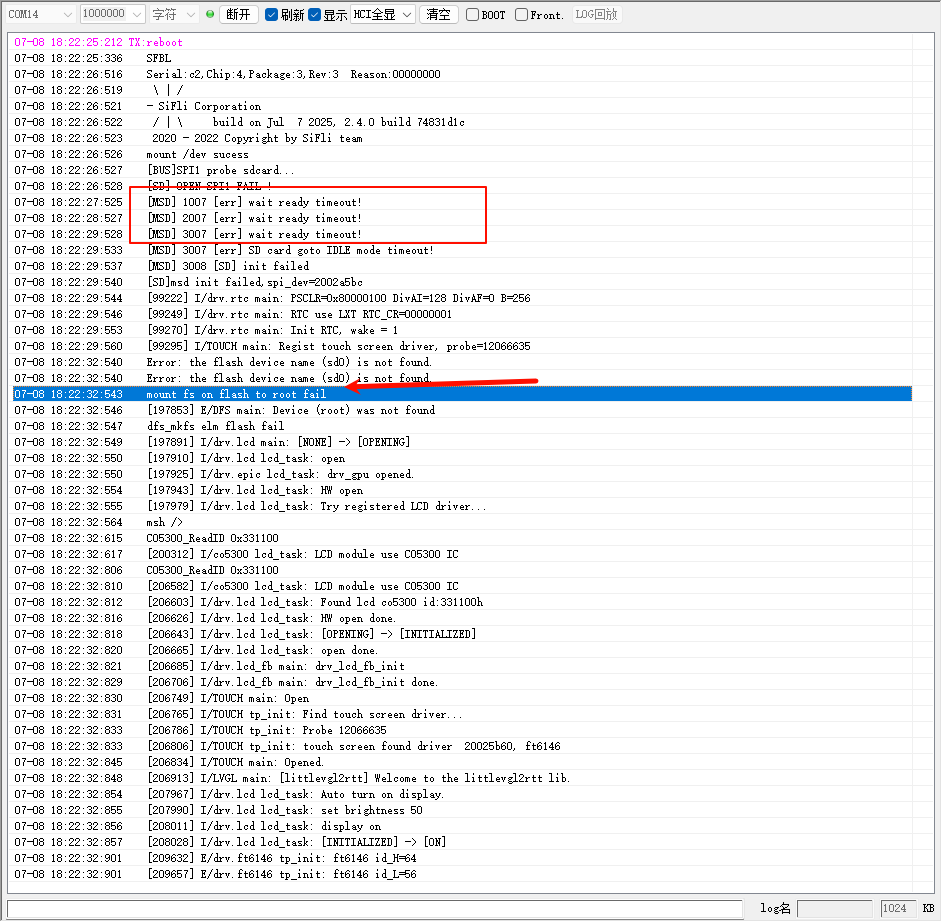

# LVGL v8官方Example
## 介绍

本示例用来测试LVGL V8的API，使用官方提供的example。
可以替换 src/main.c (模拟器在 simulator/applications/application.c) 里面的lv_example_scroll_1()函数，来测试其他API，
其他API函数，参考src/examples/lv_examples.h里面的函数定义。

## 工程编译及下载：
板子工程在project目录下可以通过指定board来编译适应相对board的工程，
- 比如想编译可以在HDK 563上运行的工程，执行scons --board=eh-lb563即可生成工程
- 下载可以通过build目录下的download.bat进行，比如同样想烧录上一步生成的563工程，可以执行.\build_eh-lb563\download.bat来通过jlink下载
- 特别说明下，对于SF32LB52x/SF32LB56x系列会生成额外的uart_download.bat。可以执行该脚本并输入下载UART的端口号执行下载
模拟器工程在simulator目录下，
- 使用 scons 进行编译，SiFli-SDK/msvc_setup.bat文件需要相应修改，和本机MSVC配置对应
- 也可以使用 scons --target=vs2017 生成 MSVC工程 project.vcxproj, 使用Visual Studio 进行编译。

```{note}
如果不是使用VS2017, 例如 VS2022, 加载工程的时候，会提示升级MSVC SDK, 升级后就可以使用了。
```

##  补充说明--如何使用sjpg
源码路径：SiFli-SDK\example\multimedia\lvgl\lvgl_v8_examples
### 支持的平台
例程可以运行在以下开发板
* sf32lb52-lchspi-ulp
* sf32lb52-lcd_n16r8


### 概述
* 通过插入 SD 卡完成文件系统挂载后，读取其中的.sjpg 与.jpg 格式图片并在屏幕上显示

### 硬件需求
* 黄山派的开发板或者52x系列开发板
* 一根具有数据传输能力的USB数据线
* 一张tf卡,一个tf读卡器

### 例程的使用
#### 编译和烧录
演示代码默认为显示图片是：``` small_image.sjpg ``` 

切换到例程project目录，运行scons命令执行编译：

```
scons --board=sf32lb52-lchspi-ulp -j8
```

执行烧写命令
```
build_sf32lb52-lchspi-ulp_hcpu\uart_download.bat
```

按提示选择端口即可进行下载：

```none
please input the serial port num:5
```

#### 例程输出结果展示:
* 插入SD卡后，挂载文件系统，并读取文件系统中的图片和显示图片log，其中log中会有`mount fs on flash to root success `就说明文件系统挂载成功


* 可以输入ls 查看文件系统内的图片文件


### 例程效果展示


#### 例程的配置流程
* 默认情况下不开启spi进行对于TF文件系统的挂载，有需要的可以按照如下配置一下
* 首先可以通过TF读卡器，往tf中写入图片文件，再将tf卡插入板子中
* 通过`menuconfig`中进行如下配置，具体操作如下
``` c
menuconfig --board=sf32lb52-lchspi-ulp
```
* 开启spi总线


* 将sd\tf设备挂载在spi总线上



* 配置文件路径



* 开启lvgl的文件系统接口，配置盘符,并且开启解码器


### 异常诊断
* 异常log

如果出现上面情况，可能tf卡存在松动、tf卡不能正常通信、tf卡未插入         
      
