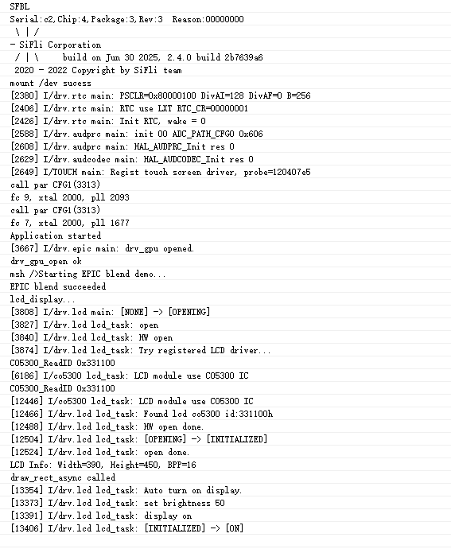
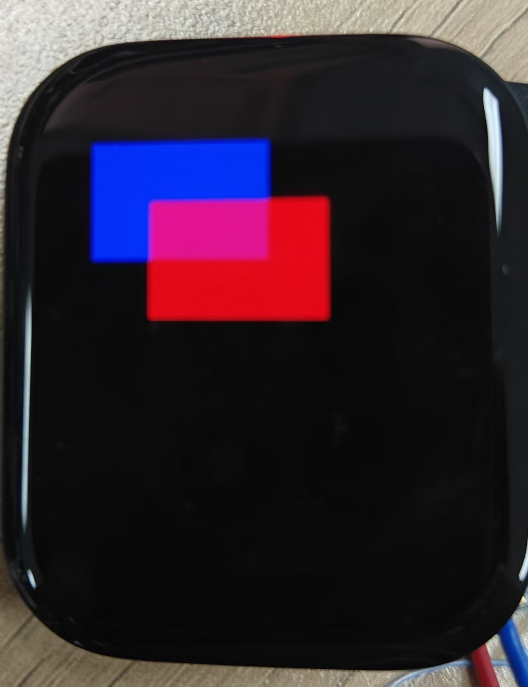
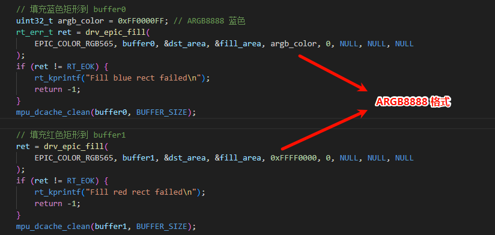
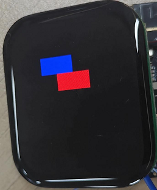
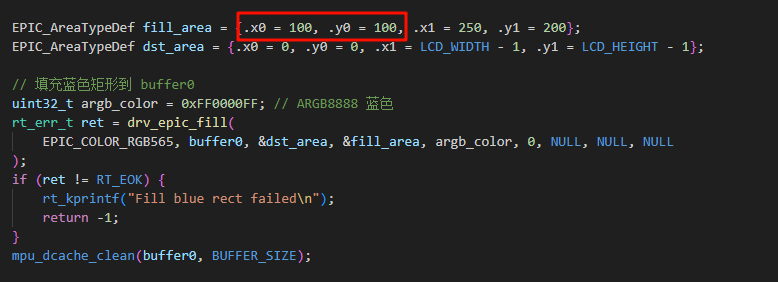
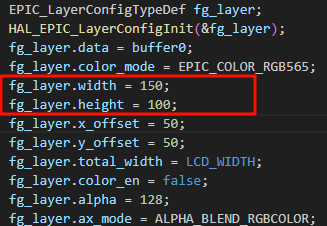
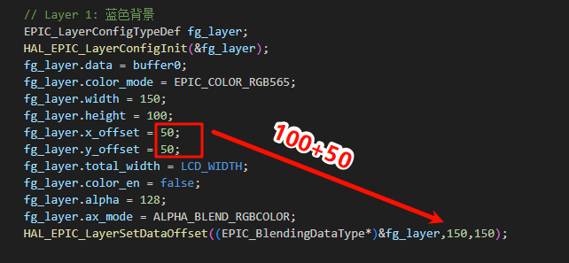

# EPIC Example Program

EPIC (ePicasso) is our self-developed graphics engine, a hardware acceleration module specifically designed for 2D/2.5D image processing, mainly used to offload CPU load in image operations and improve image processing efficiency.

## Overview
This program is a graphics blending example based on RT-Thread operating system and EPIC. It demonstrates how to use hardware acceleration for layer blending (alpha blending), superimposing two rectangular layers with transparency, and finally displaying them on the LCD screen.

## Supported Development Boards
The example can run on the following development boards:
* sf32lb52-lchspi-ulp
* sf32lb52-nano_52j
* sf32lb52-lcd_n16r8

## Example Usage
### Compilation and Flashing
Switch to the example project directory and run the scons command to compile:
```
scons --board=sf32lb52-lchspi-ulp -j8
```
Execute the flashing command:
```
build_sf32lb52-lchspi-ulp_hcpu\uart_download.bat
```
Select the port as prompted for download:
```none
please input the serial port num:6
```

#### Example Output Result Display:
Serial port window prints as shown:

Will display on the LCD screen as shown:


---

## Example Explanation
### Main program flow includes:
Initialize GPU and LCD devices ---> Draw blue and red rectangles in two buffers respectively --> Use EPIC graphics engine to blend the two layers --> Output the blended image to screen display.

### Key interfaces used:
#### 1. GPU/EPIC interfaces:
| Interface Name                        | Function Description                         |
|-----------------------------|------------------------------|
| drv_gpu_open()          | Initialize GPU resources, including interrupts         |
| drv_epic_fill()        | Fill rectangular area with specified color            |
| HAL_EPIC_LayerConfigInit()| Initialize layer configuration structure               |
| HAL_EPIC_LayerSetDataOffset() | Set layer data offset (for cropping)     |
| drv_epic_blend()    | Execute multi-layer blending operation                |
| drv_epic_wait_done()   | Wait for blending operation to complete                   |

#### 2. LCD display interfaces:
| Interface Name                                       | Function Description                             |
|-------------------------------------------|----------------------------------|
| rt_device_find("lcd") | Find LCD device                     |
| rt_device_open()      | Open LCD device                     |
| rt_device_control(..., RTGRAPHIC_CTRL_SET_BUF_FORMAT) | Set display memory format              |
| rt_device_control(..., RTGRAPHIC_CTRL_GET_INFO)   | Get LCD screen information                 |
| rt_graphix_ops()->draw_rect_async() | Asynchronously draw rectangle and refresh screen               |

---

## Important Notes!!!
When the screen doesn't display, check if the fill color is in ARGB8888 format, because the drv_epic_fill interface requires the fill color format to be ARGB8888

When the image effect doesn't meet expectations or the screen doesn't display (as shown in the example): it may be due to improper cropping.


---

#### About Cropping
* The blending principle of this example is to crop 'extract' the fill areas from the fg_layer and bg_layer layers, then place them in an output_layer.
* However, it should be noted that when cropping interfaces like HAL_EPIC_LayerSetDataOffset() are not called, the default cropping start position is the first address pointed to by the layer.data pointer, which is the top-left corner (0,0) in this example. Then the cropped area will be (layer.width - 0, layer.height - 0).
At this time, if the fill areas we set for the fg_layer and bg_layer layers are not within the cropped area, then our valid data will not be 'extracted'.
* As shown in the code of this example, the fill area is set to (100 ~ 250, 100 ~ 200), and the cropped area is (0 ~ 150, 0 ~ 100). Our fill area perfectly avoids the cropped area, so the data 'extracted' by cropping will be empty, only cropping the background.



---
So how do we both want to set the fill area position and accurately crop 'extract' our fill area?
* The first and simplest method is to keep the starting position of the fill area consistent with the position of the first address pointed to by the layer.data pointer (that is, put the fill area in the cropped area) without calling any cropping functions.
* The second method is to call the cropping interface, such as HAL_EPIC_LayerSetDataOffset(EPIC_BlendingDataType *layer, int16_t x, int16_t y), where the parameter layer is the layer to be cropped, x is the x coordinate of the starting position you want to crop, and y is the y coordinate of the starting position you want to crop. This way we can crop wherever we want. It should be noted that the values of x and y need to be added to the values of layer.x_offset and layer.y_offset on the basis of the starting position you want to crop. As shown in this example, the starting position to be cropped is (100,100), and the values of layer.x_offset and layer.y_offset are 50, 50, then our x and y values are 100 + 50 = 150, 100 + 50 = 150.
 